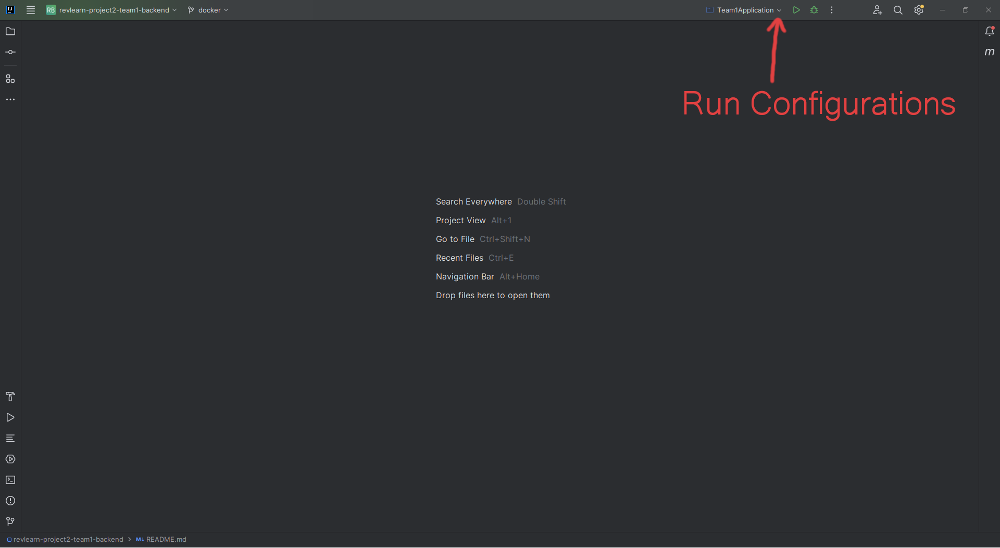
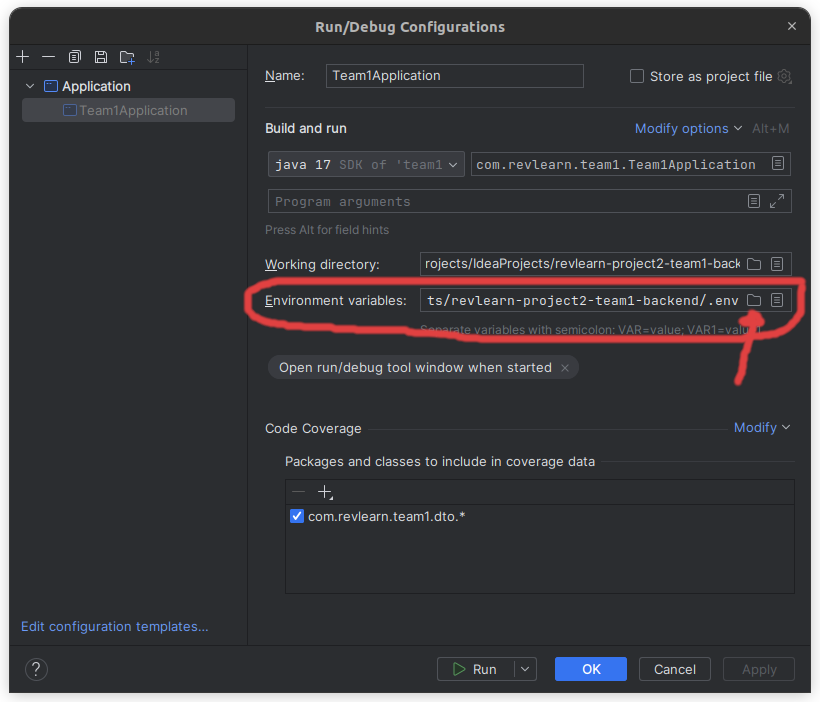
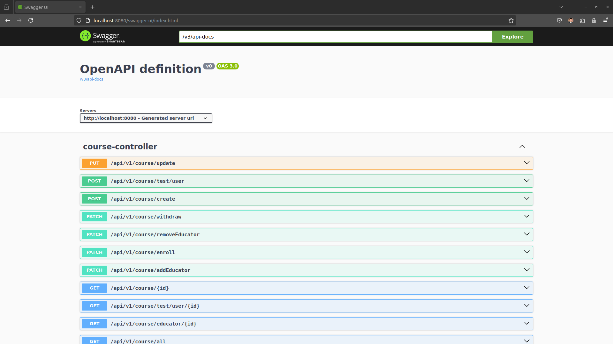
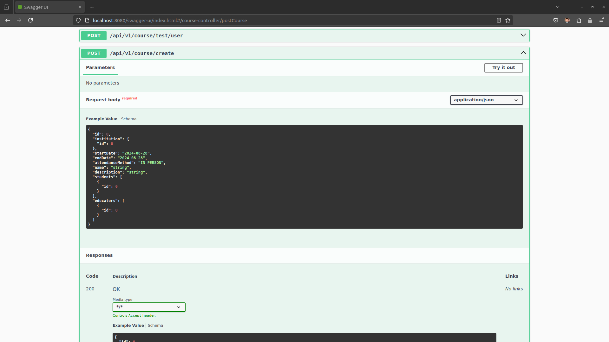

# Revlearn-backend-team1
Backend Repo for revlearn - team 1

## Database
We recommend the creation of a new database for local development of this application because Spring JPA is set to erase and recreate its database on every run.  If you need to persist data for tests you can change this JPA setting in the application.properties file on this line.
```
spring.jpa.hibernate.ddl-auto=create-drop
```
Instead of "create-drop", you can choose "update".
```
spring.jpa.hibernate.ddl-auto=update
```
See [Spring Boot Database Initialization Documentation](https://docs.spring.io/spring-boot/docs/1.1.0.M1/reference/html/howto-database-initialization.html) for more information.

## Environment Variables

### .env File Creation
1. Create an .env file in your backend root directory with this information:

```
# Assign values to these three variables with information from your local Postgres DB installation:
POSTGRES_DB=p2team1
POSTGRES_USER=p2team1_user
POSTGRES_PASSWORD=password

SPRING_DATASOURCE_USERNAME=${POSTGRES_USER}
SPRING_DATASOURCE_PASSWORD=${POSTGRES_PASSWORD}
SPRING_DATASOURCE_URL=jdbc:postgresql://localhost:5432/${POSTGRES_DB}
# Not entirely sure what this does, yet.  Could change.
SPRING_API_URL=http://localhost:8080

DOCKER_DATASOURCE_URL=jdbc:postgresql://db:5432/${POSTGRES_DB}
```
2. Assign values to these three variables with information from your local PostgreSQL DB installation:
* POSTGRES_DB
* POSTGRES_USER
* POSTGRES_PASSWORD     
3. You can now run this backend application either:
* in an IDE like IntelliJ
* as a Docker stack

### IntelliJ IDE Build

Load the .env file into your run configuration's environment variables setting.



Run the application.
### Docker Stack Build

1. Download Docker
2. In a terminal, navigate to this project's root directory, and run:
```
docker compose up --build
```

Docker will build the Spring Boot application, and the configured PostgreSQL DB into two images, create containers from those images, and start the containers with environment variables in the .env file.
#### Port Note
If you need to directly access the containerized PostgreSQL DB (like through pgadmin4), it is mapped to your host machine's port 5433 (not 5432 like normal because that would conflict with local PostgreSQL installations).

[//]: # (* The PostgreSQL DB variables of the environment file must be filled in with something, but it is not important what.)

---
## API Documentation
API documentation is automatically generated and maintained by [Swagger](https://swagger.io/solutions/api-documentation/).

If our production application is live, you should be able to simply go to this [link](http://ec2-54-227-225-116.compute-1.amazonaws.com/swagger-ui/index.html) to see our Swagger UI.  If it is not live, you will have to run the application locally in a development environment, and use the development link:
```
http://localhost:8080/swagger-ui.html
```
### Swagger Tutorial

1. This is an example of what a Swagger UI looks like.



2. Each section is a collection of routes, and each route is exactly what you append to the application's base URL:
* Development: http://localhost:8080/
* Production: TBD
3. Expand any route to view example JSON formats for requests and
   responses.



---

## Production Deployment
### Prerequisites
* A Docker Registry account. [Docker Hub](https://hub.docker.com/) is a popular choice.
* An AWS EC2 instance running (preferably Amazon Linux 2 or Ubuntu).
* Docker installed on your EC2 instance.
* SSH access to your EC2 instance.
    

### Process Outline
1. Build Docker Image
2. Push Docker Image to Docker Registry
3. Create and Upload Production .env File
4. Pull Docker Image to EC2 Instance
5. Run Docker Container

### 1. Build Docker Image
Navigate to the project's root directory and run the terminal command: 
```
docker build -t revlearn:latest .
```
Do not forget the period at the end to denote the current directory.
### 2. Push Docker Image to Docker Registry
Create a personal repository on your Docker Registry, and use its name to tag the Docker image:
```
docker tag revlearn:latest <DockerRegistryUsername>/<DockerRegistryRepository>:latest
```
Log into your repository account in terminal:
```
docker login
```
Push the image to your repository:
```
docker push <DockerRegistryUsername>/<DockerRegistryRepository>:latest
```
Verify your push succeeded via a web browser visit to your Docker registry, or pull it in the terminal:
```
docker pull <DockerRegistryUsername>/<DockerRegistryRepository>:latest
```
### 3. Create and Upload Production .env File
Create an environment file to be used in production:
```
# AWS PostgreSQL DB Credentials
AWS_POSTGRES_DB=<AWS-DB>
AWS_POSTGRES_USER=<AWS-User>
AWS_POSTGRES_PASSWORD=<AWS-Password>
AWS_POSTGRES_URL=<AWS DB Public (or Private if security correctly configured) Url>

# AWS
SPRING_DATASOURCE_USERNAME=${AWS_POSTGRES_USER}
SPRING_DATASOURCE_PASSWORD=${AWS_POSTGRES_PASSWORD}
SPRING_DATASOURCE_URL=jdbc:postgresql://${AWS_POSTGRES_URL}:5432/${AWS_POSTGRES_DB}

# Used by sample data initializer
SPRING_API_URL=http://localhost:8080/api/v1

# JWTs
SECRET_KEY=<base64-Key>
```
Replace the respective angle bracketed placeholders with your production database information and a secret key for the JWTs:
* AWS_POSTGRES_DB
* AWS_POSTGRES_USER
* AWS_POSTGRES_PASSWORD
* AWS_POSTGRES_URL
* SECRET_KEY

Next, secure copy the environment file to your EC2 instance with your pem key file:
```
scp - i ~/.ssh/<PemKeyFile>.pem <production-env-file> ec2-user@<EC2-IP-Address>:/home/ec2-user
```
### 4. Pull to EC2 Instance
Secure Shell into your AWS EC2 instance with your pem key file.
```
ssh -i ~/.ssh/<PemKeyFile>.pem ec2-user@<EC2-IP-Address>
```
Pull the Docker Image:
```
docker pull <DockerRegistryUsername>/<DockerRegistryRepository>:latest
```
### 5. Run Docker Container
Inside the EC2 instance, instantiate the Docker container with the production environment variables:
```
docker run -d -p 8080:8080 --name RevLearnBackend --env-file <production-env-file> <DockerRegistryUsername>/<DockerRegistryRepository>:latest
```
Verify the application works with test requests.

* Note: If your AWS settings only have port 80 exposed to HTTP traffic, (which is a recommended practice), then you will need a reverse proxy server like [nginx](https://nginx.org/) to map the standard browser requests (port 80) to the Java Spring Boot application (port 8080).
